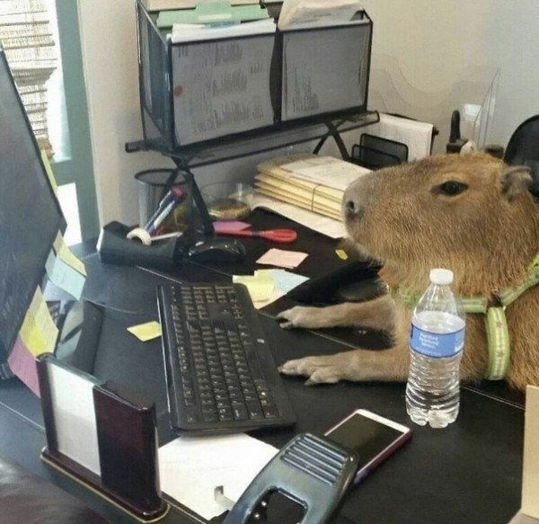

### Introduction

Лабораторная работа №1 по курсу "Машинное обучение" на ИАДе ВШЭ  
Задача состоит в предсказании бинарного признака, описывающего тип глиомы (опухоли глиальных тканей головного и спинного мозга) - LGG (глиома низкой степени злокачественности) или GBM (глиобластома, очень агрессивная опухоль, плохо поддающаяся лечению).

### Data

В датасете имеются следующие признаки:  
`Gender` -- пол (0 = "male"; 1 = "female")  
`Age_at_diagnosis` -- возраст установки диагноза с точностью до дней  
`Race` -- раса (0 = "white"; 1 = "black or african American"; 2 = "asian"; 3 = "american indian or alaska native")  
И 20 признаков, соответствующих определённым генам, со значениями `MUTATED` либо `NOT_MUTATED`  

Целевая переменная -- `Grade`, принимающая значения "LGG" и "GBM"  

### Team

_24ИАД_  

Суслова Варвара  
Сенников Андрей  
Рябинина Полина  
Денисов Денис  
Козулин Илья  
Авилов Максим
